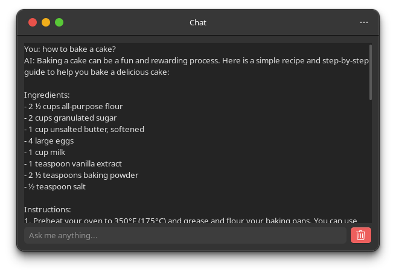

# chatgptclient


Native gui client for OpenAI chatgpt

### **[Screenshots](.github/images)**:



# Installation
To install chatgptclient, you can simply run
```
nimble install chatgptclient
```
- Uninstall with `nimble uninstall chatgptclient`.
- nimble repo page: https://nimble.directory/pkg/chatgptclient

# Requisites

- [Nim](https://nim-lang.org)
